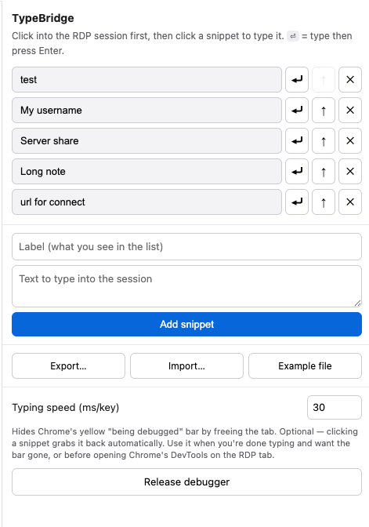

  

# TypeBridge

*Bridges your typing across the Remote Desktop gap — click a saved snippet and it types itself into the session, no copy/paste required.*

A Chrome extension that turns a list of saved snippets into clickable buttons.
Click one and it **types the text for you** into a web-based Remote Desktop
session — as if you'd typed it on the keyboard.

## Why this exists

The day-to-day problem it solves:

- You work with a remote machine through a **web-based Remote Desktop** session
  that runs inside a Chrome tab.
- The remote screen may be rendered as a canvas, so there are no local form
  fields for an extension to fill directly.
- Copy/paste can be unreliable across the browser-to-remote-desktop boundary.
- If your local and remote machines use different shortcut conventions, like
  Mac `Cmd` versus Windows/Linux `Ctrl`, muscle memory gets weirdly expensive.

So getting a username, a server path, a command, or a block of text into that
remote session can become slow and error-prone. This extension sidesteps the
whole problem: instead of copying and pasting, it **types** your saved text
straight into the session, character by character, as real keystrokes.

## How it works (in short)

Many web Remote Desktop clients draw the remote screen as an image or a
`<canvas>` inside your local Chrome, so there may be no text boxes to fill on
the local page. The extension uses Chrome's built-in automation (the DevTools
Protocol) to send genuine key presses to that tab. The Remote Desktop client
forwards them to the remote machine exactly as if they came from your keyboard.
No clipboard handoff, no shortcut-translation circus.

Because of that, while it's typing you'll see Chrome's yellow
*"…started debugging this browser"* bar — that's normal and expected.

> The extension runs entirely in your **local Chrome**. It never installs
> anything on, or connects directly to, the remote machine.

## Install

1. Open `chrome://extensions`.
2. Turn on **Developer mode** (top right).
3. Click **Load unpacked** and select this folder.
4. Click the extension's toolbar icon to open the side panel.

> After pulling changes, click the ↻ refresh icon on the extension's card to reload it.

## Use

1. Add snippets in the side panel: a **Label** (what you see) and the **Text**
   (what gets typed).
2. Switch to your Remote Desktop tab and **click into a field** in the session.
3. Click a snippet to type it. Use the **⏎** button to type it *and* press Enter.

Tips:
- **Typing speed** (footer) — raise the ms/key value if characters get dropped
  over a slow connection.
- **Release debugger** (footer) — hides the yellow bar by freeing the tab; it's
  optional, and typing grabs it back automatically.

## Screenshot

  

## Backups & sharing your list

- **Export…** saves your list to a `.yaml` file.
- **Import…** loads snippets from a `.yaml` (or older `.json`) file and **adds**
  them to your list (it never wipes what you already have).
- **Example file** downloads a ready-made template with comments showing the format.

The list itself is stored by Chrome on this machine (`chrome.storage.local`). It
persists across restarts but isn't synced to other computers — use Export to back
it up or move it.

See [`PRIVACY.md`](PRIVACY.md) for the privacy policy.

## Files

| File | Purpose |
|------|---------|
| `manifest.json` | Extension manifest (Manifest V3). |
| `icons/` | Toolbar / extension icons (16–128 px). |
| `logo.png` / `favicon-pic.png` | Brand art (logo used in this README). |
| `background.js` | The keystroke engine. |
| `sidepanel.html` / `.css` / `.js` | The snippet-list UI. |
| `js-yaml.min.js` | Bundled YAML parser for Export/Import (runs offline). |
| `README-todo.md`, `readme-architecture.md`, `conversation.md` | Project notes. |

See **`readme-architecture.md`** for the design details and trade-offs.
